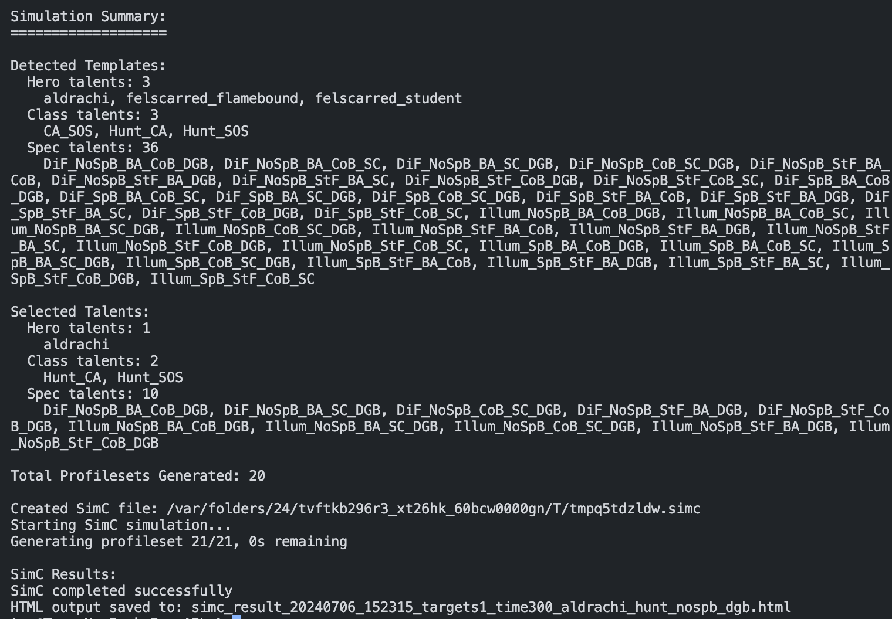

# SimulationCraft Profile Generator
This script generates and runs SimulationCraft profiles for World of Warcraft character optimization.

## Features
- Automatically generates profiles based on talent combinations
- Filters talent combinations based on user input
- Supports custom fight durations and target counts
- Generates an HTML output with simulation results

## Requirements
- Python 3.6+
- SimulationCraft executable
- `character.simc` and `profile_templates.simc` files for your character/spec

## Usage
```
python generate_sims.py --simc <path_to_simc> --folder <path_to_simc_files> [options]
```

### Required Arguments
- `--simc`: Path to the SimulationCraft executable
- `--folder`: Path to the folder containing character.simc and profile_templates.simc

### Optional Arguments
- `--targets`: Number of targets for the simulation (overrides character.simc)
- `--time`: Fight duration in seconds (overrides character.simc)
- `--targettime`: List of target and time combinations for multiple simulations
- `--hero-talents`: Hero talents to include (default: all)
- `--hero-talents-exclude`: Hero talents to exclude (default: all)
- `--class-talents`: Class talents to include (default: all)
- `--class-talents-exclude`: Class talents to exclude (default: all)
- `--spec-talents`: Spec talents to include (default: all)
- `--spec-talents-exclude`: Spec talents to exclude (default: all)

## Examples
Run all talent combinations:

```
python generate_sims.py --simc /path/to/simc --folder /path/to/simc_files
```

Run specific talent combinations:

```
python generate_sims.py --simc /path/to/simc --folder /path/to/simc_files --hero "spb dgb" --class "fot" --spec "fb"
```

Change fight parameters:

```
python generate_sims.py --simc /path/to/simc --folder /path/to/simc_files --targets 3 --time 180
```

You can run multiple simulations with different target and time combinations using the `--targettime` option.

Example below will run three simulations:
1. 1 target for 300 seconds
2. 6 targets for 60 seconds
3. 10 targets for 60 seconds

You can specify as many "targets,time" combinations as you want, separated by spaces. Each combination should be in the format "targets,time" without brackets.

The script will generate separate output files for each simulation, with the corresponding target and time values included in the filename.

```
python generate_sims.py --simc /path/to/simc --folder /path/to/folder --targettime 1,300 6,60 10,60 --hero aldrachi --class hunt --spec nospb dgb
```

## Output
The script generates an HTML file with simulation results in the current directory. The filename includes a timestamp and the simulation parameters.



## Adapting for Different Specs
To use this script for a different spec:

1. Replace the contents of vengeance folder file with one for your desired spec. Possible to rename the folder to match your spec, but need to update generate_sims.py accordingly.
2. Update the profile_templates.simc file with the appropriate talent options for your spec.
3. Ensure the talent names in the --hero, --class, and --spec arguments match those in your profile_templates.simc file.

No changes to the Python script itself are necessary unless your spec requires unique handling of certain parameters.

## Notes
- The script assumes a specific structure for the profile_templates.simc file. Ensure your file follows the expected format with sections for Hero, Class, and Spec talents (denoted by the comment `#` symbols).
- Talent filtering is case-insensitive and requires all specified terms to be present in a talent name.
- The script creates a temporary .simc file for the simulation, which is not automatically deleted after execution.